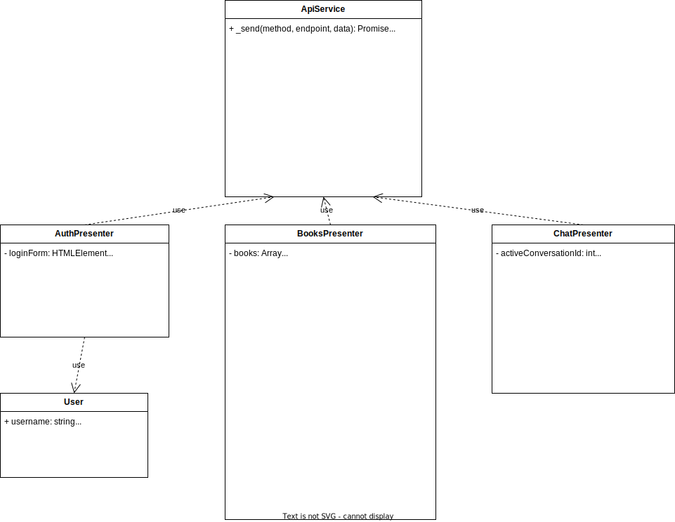

# 3. Architettura del Sistema

## 3.1 Pattern MVP
Il sistema adotta un'architettura **Model-View-Presenter (MVP)**.

### View
* Definisce la struttura della pagina e gli stili.
* Espone gli elementi del DOM (bottoni, form) che vengono manipolati dal Presenter.

### Presenter
* Intercetta gli eventi utente dalla View.
* Invoca il Model remoto (tramite Fetch API).
* Riceve i dati (JSON) e aggiorna la View manipolando il DOM.
* Gestisce la logica di presentazione.

### Model
* Rappresenta lo stato del sistema e la Business Logic pura.
* Espone un'interfaccia RESTful (JSON)
* Riceve comandi dal Presenter.
* Valida le regole di business (Sicurezza, Integrità).
* Restituisce i dati aggiornati o errori.

---

## 3.2 Schema Dati

Questa sezione descrive la modellazione dei dati del sistema.

### 3.2.1 Modello Entità-Relazione

Il modello logico dei dati si basa su quattro entità principali: **User**, **Book**, **Transaction** e **Message**. 
Le principali scelte progettuali includono:

* **Integrità Referenziale:** L'uso di chiavi esterne (`seller_id`) con vincolo `ON DELETE CASCADE` assicura che alla rimozione di un utente vengano rimossi automaticamente anche i suoi annunci, prevenendo dati orfani.
* **Sicurezza:** Le password non vengono salvate in chiaro, ma sotto forma di hash.
* **Tipi di dato:** Per il prezzo è stato scelto il tipo `DECIMAL` per garantire precisione nelle operazioni monetarie, evitando gli errori di arrotondamento tipici dei numeri in virgola mobile (`FLOAT`).
* **Storico Prezzi:** Nella tabella transactions viene salvato una copia del prezzo al momento dell'acquisto. Questo garantisce che lo storico ordini rimanga corretto anche se il prezzo originale del libro venisse modificato in futuro.


---


### 3.2.2 Interfaccia al Database

Per la gestione della persistenza è stato adottato il design pattern **Data Access Object (DAO)**, con l'obiettivo di isolare completamente la logica di accesso ai dati dal resto dell'applicazione. Questa scelta permette ai Controller di interagire con il database attraverso metodi ad alto livello, ignorando i dettagli implementativi del linguaggio SQL o del driver specifico utilizzato.

L'architettura si articola su due componenti principali:

* **DatabaseInterface (Contratto)**: Un'interfaccia PHP che definisce formalmente le operazioni CRUD (Create, Read, Update, Delete) e di autenticazione disponibili nel sistema.
* **DatabaseService (Implementazione)**: La classe concreta che realizza l'interfaccia utilizzando l'estensione **PDO (PHP Data Objects)**. Questa classe incapsula internamente la connessione al database, gestita in modo sicuro tramite variabili d'ambiente per evitare l'esposizione di credenziali nel codice sorgente.


1. **Encapsulation**: Il driver PDO è dichiarato come proprietà privata all'interno del `DatabaseService`, impedendo accessi non autorizzati alla connessione dall'esterno della classe.
2. **Prepared Statements**: Ogni interazione con il database avviene tramite l'uso di query preparate; questa pratica è essenziale per neutralizzare il rischio di attacchi **SQL Injection**, garantendo che i dati di input (come email o ISBN) siano trattati correttamente dal driver.
3. **Iniezione delle Dipendenze**: L'istanza di `DatabaseService` viene creata centralmente nel router (`index.php`) e passata ai controller tramite i loro costruttori. Questo approccio facilita la manutenzione e assicura che l'intera richiesta HTTP utilizzi una singola connessione persistente.
4. **Data Mapping**: Il servizio si occupa di trasformare i risultati grezzi delle query (array associativi) in oggetti di tipo `Book` o `User`, permettendo ai controller di operare su entità tipizzate e coerenti con il dominio dell'applicazione.


---
## 3.3 Sicurezza

Questa sezione definisce le specifiche di sicurezza per l'autenticazione e l'autorizzazione del sistema.

### 3.3.1 Hashing delle Password

Le password degli utenti non vengono mai salvate in chiaro nel database (RNF06).

| Aspetto | Specifica |
| :--- | :--- |
| **Funzione** | `password_hash()` di PHP |
| **Algoritmo** | `PASSWORD_BCRYPT` |
| **Verifica** | `password_verify()` (gestita dall'interfaccia DB) |

**Nota:** L'hashing viene eseguito nel backend (AuthController) prima di passare l'oggetto User all'interfaccia database.

### 3.3.2 JSON Web Token (JWT)

Il sistema utilizza JWT per la gestione delle sessioni utente e l'autorizzazione agli endpoint protetti.

| Aspetto | Specifica |
| :--- | :--- |
| **Libreria** | `firebase/php-jwt` |
| **Algoritmo** | HS256 (HMAC-SHA256) |
| **Chiave Segreta** | Variabile d'ambiente `JWT_SECRET` |
| **Scadenza Token** | 8 ore (28800 secondi) |

**Struttura del Token:**
```
Header.Payload.Signature
```

**Payload del Token:**
```json
{
  "sub": 123,
  "email": "utente@esempio.it",
  "iat": 1737450000,
  "exp": 1737478800
}
```

| Campo | Descrizione |
| :--- | :--- |
| `sub` | ID dell'utente (subject) |
| `email` | Email dell'utente |
| `iat` | Timestamp di emissione (issued at) |
| `exp` | Timestamp di scadenza (expiration) |

### 3.3.3 Messaggi di Errore

Per prevenire attacchi di enumerazione utenti, i messaggi di errore relativi all'autenticazione sono generici:

| Scenario | Messaggio Restituito |
| :--- | :--- |
| Email non registrata | "Invalid credentials" |
| Password errata | "Invalid credentials" |
| Token mancante/invalido | "Unauthorized" |
| Token scaduto | "Unauthorized" |

**Nota:** Non viene mai rivelato se un'email è registrata o meno nel sistema.

### 3.3.4 Validazione Input

| Campo | Regole di Validazione |
| :--- | :--- |
| `email` | Formato email valido, non vuoto |
| `username` | Non vuoto |
| `password` | Minimo 8 caratteri |

---
## 4 Presenter Class Diagram


## Frontend Presenter Architecture - Class Diagram Explanation

This document explains the structure and relationships of the frontend classes as depicted in the class diagram. The architecture follows a **Model-View-Presenter (MVP)** pattern variant, where "Presenters" handle UI logic and API communication, while the "View" is manipulated directly via the DOM (or simple HTML references).

### 1. ApiService (Static Service)
**Role**: The central communication hub for the entire frontend.
*   **Nature**: It consists of static methods handling AJAX requests (`$.ajax`).
*   **Responsibilities**:
    *   Manages the JWT Token (attaching `Authorization` header).
    *   Exposes endpoints for Login, Registration, Book operations (Get, Create, Update, Delete), Purchases, and Messaging.
    *   **Abstraction**: Hides the underlying HTTP details from the Presenters.

### 2. AuthPresenter
**Role**: Manages User Authentication flows.
*   **Key Responsibilities**:
    *   Listens to Login and Registration forms.
    *   Calls `ApiService.login()` and `ApiService.register()`.
    *   **JWT Handling**: Parses the received JWT token to extract user info (`parseJwt`) and stores it in `localStorage`.
    *   Redirects the user to the dashboard upon success.

### 3. BooksPresenter
**Role**: The primary controller for the Book Marketplace interface.
*   **Key Responsibilities**:
    *   **Dashboard**: Fetches and renders all specific books (`fetchBooks`, `renderBooks`).
    *   **Filters**: Implements filtering logic (Strategy Pattern with `CompositeFilter`, `GeneralSearchFilter`, etc.) to search books by title, ISBN, teacher, or course.
    *   **My Books**: Displays books belonging to the logged-in user (`handleMyBooks`).
    *   **CRUD Operations**: Handles creating (`handleInsertAd`), updating price (`handleEditBook`), and deleting (`handleDeleteBook`) advertisements.
    *   **Commerce**: Handles the buying process (`handleBuyBook`) and displays Purchase History (`renderPurchases`) and Sales History (`renderSales`).
    *   **Navigation**: Manages the user dropdown menu including logout.

### 4. ChatPresenter
**Role**: Manages the Real-time(ish) Messaging System.
*   **Key Responsibilities**:
    *   **Conversations**: Fetches and lists active conversations (`fetchConversations`).
    *   **Messaging**: Displays chat history (`renderMessages`) and sends new messages (`sendMessage`).
    *   **Deep Links**: Handles URL parameters (e.g., `?userId=X`) to open a specific chat directly from a book card.
    *   **UI Updates**: Formats timestamps and distinguishes between sent and received messages.

### 5. User (Model)
**Role**: A simple data transfer object (DTO).
*   **Responsibilities**:
    *   Encapsulates user registration data (`username`, `email`, `password`) before sending it to the API.

### Relationships
*   **Dependency**: All Presenters (`AuthPresenter`, `BooksPresenter`, `ChatPresenter`) depend on `ApiService` to perform network operations.
*   **Association**: `AuthPresenter` uses the `User` class to structure registration data.
*   **Flow**:
    1.  `BooksPresenter` (Book Card) -> Request to Chat (`window.location.href`).
    2.  `ChatPresenter` initializes -> Checks URL params -> Opens Conversation.

