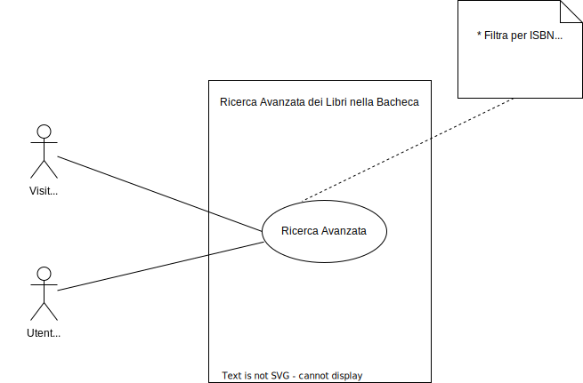
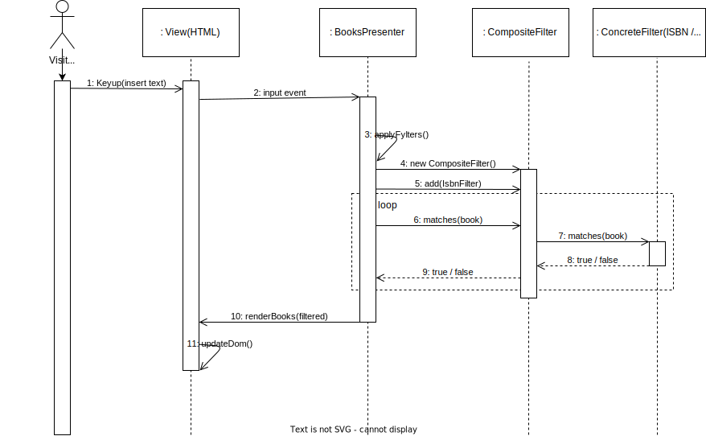
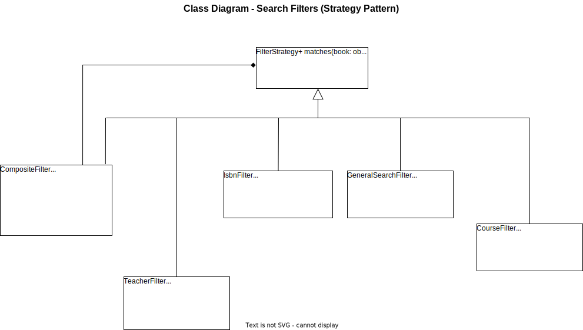

# UC06 - Ricerca Avanzata

## 1. Panoramica
**Descrizione:** Consente a un Utente o Visitatore di cercare libri nella bacheca filtrando per ISBN, corso o docente. La ricerca viene eseguita lato Frontend sui dati già caricati.

| &nbsp; | &nbsp; |
| :--- | :--- |
| **Attori** | Visitatore, Utente Autenticato |
| **Pre-condizioni** | La bacheca dei libri è stata caricata. |
| **Post-condizioni** | Vengono visualizzati solo i libri che corrispondono ai criteri di ricerca. |

---

## 2. Flussi di Eventi

### Flusso Principale
1. L'**Utente/Visitatore** visualizza la bacheca con tutti i libri disponibili.
2. L'**Utente/Visitatore** inserisce uno o più criteri di ricerca (ISBN, corso, docente).
3. Il sistema (Frontend) filtra i risultati in tempo reale.
4. Il sistema mostra solo i libri che corrispondono ai criteri inseriti.

### Flussi Alternativi

* **A1: Nessun risultato trovato**
    1. Nessun libro corrisponde ai criteri di ricerca.
    2. Il sistema mostra un messaggio: *"Nessun libro trovato per i criteri selezionati"*.

* **A2: Ricerca parziale**
    1. L'utente inserisce solo parte di un criterio (es. solo alcune cifre dell'ISBN).
    2. Il sistema mostra tutti i libri che contengono la stringa parziale.

* **A3: Reset ricerca**
    1. L'utente svuota i campi di ricerca.
    2. Il sistema mostra nuovamente tutti i libri disponibili.

---

## 3. Activity Diagram

---

## 4. Criteri di Accettazione
* La ricerca per ISBN deve restituire corrispondenze esatte o parziali.
* La ricerca per corso deve essere case-insensitive.
* La ricerca per docente deve essere case-insensitive.
* È possibile combinare più criteri di ricerca contemporaneamente.
* La ricerca deve funzionare sia per Visitatori che per Utenti autenticati.
* Svuotando i campi di ricerca devono ricomparire tutti i libri.

---

## 5. Piano di Test Manuale
| ID | Azione | Risultato Atteso | Valida |
| :--- | :--- | :--- | :---: |
| **T01** | Inserire un ISBN completo esistente | Viene mostrato solo il libro con quell'ISBN. | ✅ |
| **T02** | Inserire un ISBN parziale (es. prime 5 cifre) | Vengono mostrati tutti i libri il cui ISBN contiene quella sequenza. | ✅ |
| **T03** | Inserire un nome corso esistente | Vengono mostrati tutti i libri associati a quel corso. | ✅ |
| **T04** | Inserire un nome docente esistente | Vengono mostrati tutti i libri associati a quel docente. | ✅ |
| **T05** | Inserire criteri che non corrispondono a nessun libro | Messaggio "Nessun libro trovato". | ✅ |
| **T06** | Combinare ISBN + Corso | Vengono mostrati solo i libri che soddisfano entrambi i criteri. | ✅ |
| **T07** | Svuotare tutti i campi di ricerca | Tornano visibili tutti i libri disponibili. | ✅ |

---

## 6. Design Tecnico

### Sequence Diagram

### Class Diagram

